<div align="center">
  
</div>

<div align="center">

[](https://www.timtulang.me)&nbsp;
[](mailto:tulangtimothy@gmail.com)&nbsp;
[](https://www.linkedin.com/in/tim-tulang-211a26293/)

</div>

---

```
  MELCHIOR-1  [ SCIENTIST ]  Does it work?         ██  APPROVED
  BALTHASAR-2 [ MOTHER    ]  Does it feel right?   ██  APPROVED
  CASPAR-3    [ WOMAN     ]  Does it matter?        ██  APPROVED
                      UNANIMOUS. PROCEEDING.
```

---

### `>` Languages


### `>` Frontend


### `>` Backend & Database


### `>` AI / Data Science


### `>` Mobile & Tools


---

### Active Operations

| Operation | Stack | Status |
|-----------|-------|--------|
| Barangay Document Request & Records System | React · Vite · Supabase · Dialogflow · Vercel | `DEPLOYED` |
| React App w/ Browser ML Inference | React · Python · TensorFlow · ONNX/TF.js | `SHIPPED` |
| InnOlympics 2025 Hackathon — Mobile App | FlutterFlow · Supabase · PostgreSQL | `BEST WORKING APP` |

---

<div align="center">
  
  
</div>

<div align="center">
  
</div>

---

<div align="center">
  <sub>Pattern Blue confirmed · Synchronization rate: rising</sub>
</div>
